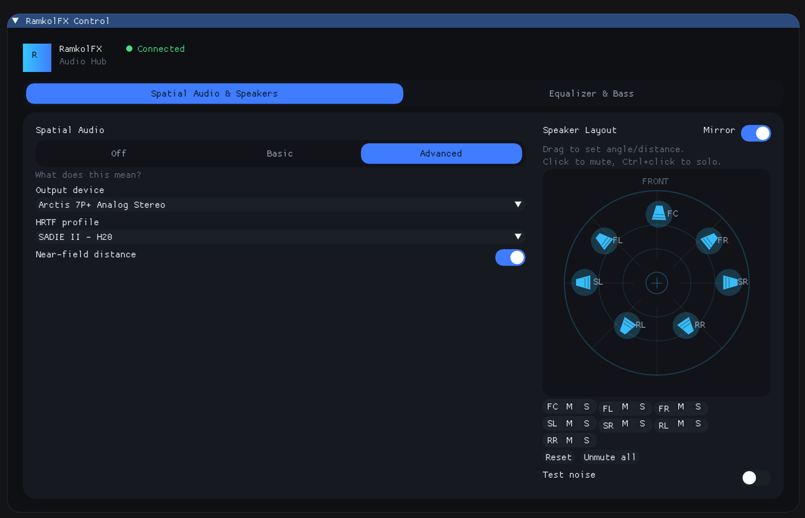
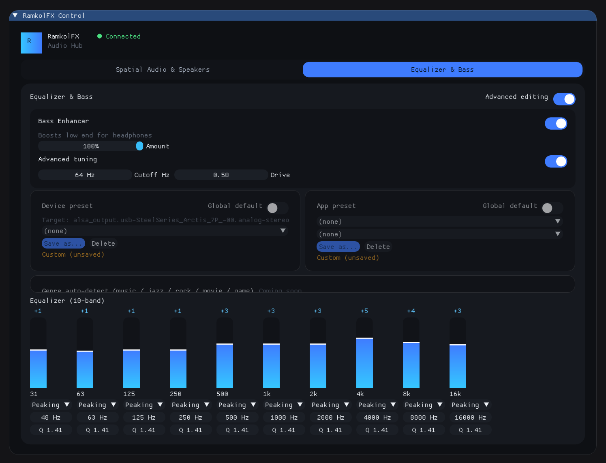

# RamkolFX

A Linux audio DSP daemon that provides ambisonics-style 7.1-to-stereo
spatialization for headphones. Unlike typical "virtual surround" plugins
that apply a fixed per-channel HRTF, RamkolFX encodes the 7.1 signal into
an ambisonics sound field and decodes that field to stereo, so positioning
stays accurate as speakers move and the mix doesn't collapse into six
separately-panned point sources.

## Status

Pipeline runs end-to-end with three selectable spatialization paths. A
real 7.1 stream played into the virtual sink is heard, spatialized, on the
real output device. The `SetSpatialMode` control command switches between
three genuinely different signal paths (`SpatialMode`: `Off` / `Basic` /
`Advanced`):

- **Off**: static-gain downmix (`PassthroughStage`).
- **Basic**: `AmbisonicsStage` encodes the 7 non-LFE 7.1 channels as point
  sources (at their nominal speaker azimuths) into a shared first-order
  B-format sound field, then decodes that field to two virtual stereo
  speakers. This is a plain algebraic (non-HRTF) decode — an improvement
  over static downmix, but a linear 2-speaker ambisonic decode can't fully
  preserve front/back distinction.
- **Advanced**: `BinauralStage` encodes the same B-format field (via the
  shared `SpeakerLayout`), decodes it to a fixed 8-point virtual
  loudspeaker array, and convolves each virtual speaker's signal with an
  HRIR for that direction, summing the results into stereo. HRIR
  convolution runs through a KissFFT-backed partitioned overlap-save
  convolver. The HRIR source is either measured data (a SOFA file, loaded
  via libmysofa) or a procedurally-computed rigid-sphere model
  (`synthetic_hrtf.cpp`) with no data file at all. If a SofaFile source
  fails to load, Advanced mode falls back to the same algebraic decode
  Basic mode uses rather than going silent.

  HRTF perception is highly ear-shape-specific, so which source
  externalizes well varies per listener. `HrtfDeck` wraps two
  `BinauralStage`s so the active source can be switched live from the
  GUI's HRTF dropdown (or the `SetHrtfFile` control opcode) without
  restarting the daemon, crossfading between old and new over a fixed
  ~50ms window so switching never clicks. The bundled catalog
  (`GetHrtfCatalog`, see `data/hrtf/README.md`) is the MIT KEMAR default,
  8 individual subjects from the SADIE II database (Apache-2.0, safe to
  redistribute commercially — the CIPIC/ARI/Listen mirrors were
  deliberately avoided for exactly that reason), and the synthetic model.
  The daemon also watches a user-writable directory
  (`$XDG_CONFIG_HOME/ramkolfx/hrtf` by default, or `RAMKOLFX_HRTF_DIR`)
  and appends any `.sofa` files found there to the catalog, prefixed
  `(user) `, picking up additions/removals live via inotify — unlike the
  bundled entries, files placed there are never redistributed or license-
  checked by RamkolFX, so it's the place for datasets with terms that
  don't allow redistribution. The `RAMKOLFX_HRTF_SOFA` environment
  variable still works as a lower-level override for the daemon's
  *initial* source, outside the catalog entirely.

All three modes sit behind the same `DspStage` interface and share one
live-repositionable `SpeakerLayout`, so speaker position changes apply
no matter which mode is active.

A 10-band graphic EQ (`HwEqStage`, `GraphicEqFilter`) and a psychoacoustic
bass enhancer (`BassEnhancerStage`, `BassEnhancerFilter`) sit downstream of
the spatial stage, live-adjustable per-band from the GUI's "Equalizer &
Bass" tab (`SetHwEqBand` / `SetBassEnhancer` opcodes) and included in every
`GetStatus` response, same as spatial mode and speaker azimuths. The
protocol already has opcodes for named per-device/per-app EQ presets
(`SetHwEqPreset`, `SaveHwEqPreset`, `SetContentEqBand`, `SetContentEqPreset`,
`SaveContentEqPreset`, `GetEqPresetCatalog`, `GetContentStreams`) decoded on
the daemon side, but there's no handler or GUI for them yet — the
Equalizer tab renders disabled placeholder cards for device/app presets and
a "Genre auto-detect" row in their place.

Virtual speaker positions are live-repositionable both at the
`SpeakerLayout` API level (`SetSpeakerAzimuth`/`GetSpeakerAzimuth`,
lock-free, callable from any thread) and over the control protocol
(`SetSpeakerAzimuth` opcode, with current azimuths included in every
`GetStatus` response) — the GUI's speaker dial drives this live, in
whichever mode is active.

## Screenshots

> **Note:** the GUI is a convenience for exercising the daemon during
> development, not a design target right now. Functionality — the DSP
> pipeline, control protocol, and daemon behavior — is the priority; GUI
> polish is explicitly out of scope until that's solid. What's shown below
> is a work in progress, not a preview of a finished product.

| Spatial Audio & Speakers | Equalizer & Bass |
| --- | --- |
|  |  |

## Architecture

```
   client app (game, media player)
            │  renders 7.1 via OpenAL / PipeWire
            ▼
   PipeWire virtual sink  ("RamkolFX Virtual Sink")
            │  captured by the daemon
            ▼
   DSP stage  (PassthroughStage / AmbisonicsStage / BinauralStage,
               selected live by SpatialMode)
            │
            ▼
   real hardware output  (via a PipeWire playback stream)

   GUI control app  <──Unix socket, binary protocol──>  daemon
```

- **`ramkolfxd`** (the daemon) owns the real audio output device. It never
  talks to hardware directly on the input side — client apps render into a
  PipeWire virtual sink instead, exactly as if it were a normal output
  device.
- The daemon captures from that virtual sink, runs it through whichever
  DSP stage the current `SpatialMode` selects, and plays the result out
  through a second PipeWire stream pinned to a specific real hardware
  sink (selectable live via the control protocol/GUI, not "whatever is
  currently default").
- The **GUI control app** (`ramkolfx-gui`, Dear ImGui + SDL2/OpenGL3) talks
  to the daemon over the Unix domain socket to switch spatial mode,
  reposition virtual speakers, and adjust the 10-band EQ and bass
  enhancer live — all in real time, without restarting the daemon. It's
  organized into two tabs ("Spatial Audio & Speakers" and "Equalizer &
  Bass").

## Directory layout

- `common/` — shared code between daemon and GUI: the control protocol and
  a lock-free ring buffer. No PipeWire dependency.
- `daemon/` — `ramkolfxd`: the PipeWire pipeline, DSP stage, and control
  socket server.
- `gui/` — `ramkolfx-gui`: Dear ImGui + SDL2/OpenGL3 control app (build with
  `-DRAMKOLFX_BUILD_GUI=ON`). Talks to the daemon only over the Unix
  control socket — no PipeWire dependency. Tabbed layout: spatial
  mode/speakers/HRTF/output device on one tab, 10-band EQ and bass
  enhancer on the other.
- `docs/` — reserved for design notes as the DSP work lands.

## Engineering approach

The ambisonics math and the daemon/GUI control logic are being written from
scratch — that's the core IP. It's fine to bootstrap with permissively
(BSD-style) licensed third-party libraries (e.g. libmysofa for HRTF data,
KissFFT for FFT) once real DSP work starts, but they'll sit behind clean,
swappable interfaces (see `daemon/src/dsp/dsp_stage.hpp`) so they can be
replaced later without touching the rest of the pipeline.

## Control protocol

The daemon and any control client (GUI, CLI tools) speak a small
hand-rolled **binary** protocol over a Unix domain socket — not JSON —
to keep the control path cheap enough to poll frequently (e.g. for live
speaker repositioning) without parsing/allocation overhead. See
`common/include/ramkolfx/protocol.hpp` for the wire format and the full
rationale; the format is intentionally isolated to that header/.cpp pair so
it can change without touching daemon or GUI logic built on top of it.

Socket path: `$XDG_RUNTIME_DIR/ramkolfx/control.sock` (falls back to
`/tmp/ramkolfx-<uid>/control.sock`).

## Building

### Dependencies

**Daemon (`ramkolfxd`):**

- CMake >= 3.20, a C++20 compiler (GCC or Clang), Ninja (or Make),
  `pkg-config`
- PipeWire development headers: `libpipewire-0.3` (via pkg-config)
- zlib development headers (libmysofa's SOFA/HDF5 parsing depends on it)
- pthreads (part of the standard toolchain on Linux)
- Network access on first configure: `daemon/CMakeLists.txt` fetches
  libmysofa and KissFFT via CMake `FetchContent` (same mechanism
  `gui/CMakeLists.txt` already uses for Dear ImGui) since neither ships as
  a common distro package.

**GUI (`ramkolfx-gui`, only needed with `-DRAMKOLFX_BUILD_GUI=ON`):**

- SDL2 development headers: `sdl2` (via pkg-config)
- OpenGL development headers/libs
- Network access on first configure: `gui/CMakeLists.txt` fetches Dear
  ImGui via CMake `FetchContent`.

On this machine, everything above is already present (GCC 16, Clang 22,
CMake 4.4, Ninja 1.13, libpipewire-0.3 1.6.7). On a fresh machine, run
`./FetchDependencies.sh` to install your distro's packages automatically
(Debian/Ubuntu, Fedora, Arch, and openSUSE are detected via
`/etc/os-release`; pass `--no-gui` to skip the GUI-only packages). That
script's install commands, spelled out:

- Debian/Ubuntu: `sudo apt install build-essential cmake ninja-build pkg-config git libpipewire-0.3-dev zlib1g-dev libsdl2-dev libgl1-mesa-dev`
- Fedora: `sudo dnf install gcc-c++ cmake ninja-build pkgconf-pkg-config git pipewire-devel zlib-devel SDL2-devel mesa-libGL-devel`
- Arch: `sudo pacman -S base-devel cmake ninja pkgconf git libpipewire zlib sdl2 mesa`

### Build

```sh
cmake -S . -B build -G Ninja -DRAMKOLFX_BUILD_GUI=ON
cmake --build build
```

(Omit `-DRAMKOLFX_BUILD_GUI=ON` to build only the daemon, skipping the GUI
dependencies above.) Or just run `./build.sh`, which does the same thing
and builds both.

The daemon binary is `build/daemon/ramkolfxd`; the GUI binary (if built)
is `build/gui/ramkolfx-gui`.

### Convenience scripts

- **`./FetchDependencies.sh`** — installs the OS packages listed above for
  your distro. `./FetchDependencies.sh --no-gui` skips the GUI-only
  packages; `--dry-run` prints the install command without running it.
- **`./build.sh`** — configures and builds daemon + GUI into `build/`
  (same as the `cmake` invocation above). `./build.sh clean` wipes `build/`
  first.
- **`./run.sh`** — starts `ramkolfxd` in the background, waits for its
  control socket to come up, then launches `ramkolfx-gui` in the
  foreground; stops the daemon when the GUI exits or on Ctrl+C.
  `./run.sh daemon` runs only the daemon (foreground); `./run.sh gui` runs
  only the GUI, assuming a daemon is already running.
- **`./run_gui.sh`** — launches `ramkolfx-gui` on its own, assuming a
  daemon is already running and listening on the control socket. This is
  what `run.sh` calls internally for the GUI half.

All three build/run against the same `build/` directory and must be run
from the repo root (they `cd` to their own location first, so `./run.sh`
works from anywhere).

## Running

```sh
./run.sh
```

This starts `ramkolfxd` in the background, waits for its control socket to
come up, then launches `ramkolfx-gui` in the foreground; the daemon stops
when the GUI exits or on Ctrl+C. Run `./run.sh daemon` to start only the
daemon (foreground, no GUI), or `./run.sh gui` to launch only the GUI
against a daemon that's already running.

Starting the daemon creates the "RamkolFX Virtual Sink" in the PipeWire
graph and starts a playback stream pinned to a specific real hardware sink
(swap live via `SetOutputDevice` / the GUI's output device picker). On
first run, or if the previously-chosen device is no longer present (e.g.
unplugged, renamed), the daemon auto-picks whichever real sink PipeWire
currently reports and persists that choice to `settings.conf`, alongside
mode/speaker layout/HRTF choice (see `SettingsStore`); the next run reuses
it, and any live pick made from the GUI is remembered the same way. The
daemon also claims the virtual sink as your system default output as soon
as it
starts (see `DeviceRegistry::ClaimVirtualSinkAsDefault()`), so most apps
route to it automatically with no manual step. If you'd rather route a
specific app instead of changing the system default, use `pavucontrol`,
`wpctl`, or `pw-play --target ramkolfx_virtual_sink some_7.1_file.wav`.
Stop the daemon with Ctrl+C or `SIGTERM`; it tears down the virtual sink
and unlinks the control socket on the way out.

Setting the virtual sink as default is safe against feedback: the
daemon's own hardware output stream is pinned by `target.object` (and
`node.dont-reconnect`) to the real sink it was configured with, so it
never resolves to "whatever is default" and can't loop back into the
virtual sink it just claimed.


## Adding your own SOFA files

Beyond the bundled catalog (MIT KEMAR + 8 SADIE II subjects + the
synthetic model, see `data/hrtf/README.md`), you can add your own HRTF
measurements — CIPIC, ARI, Listen, or your own — without rebuilding:

1. Drop the `.sofa` file into `$XDG_CONFIG_HOME/ramkolfx/hrtf` (falls
   back to `~/.config/ramkolfx/hrtf`, created automatically on first
   run), or point `RAMKOLFX_HRTF_DIR` at a directory of your choice.
2. That's it — the daemon watches the directory via inotify and adds it
   to the HRTF catalog live, prefixed `(user) `, no restart needed. It'll
   show up in the GUI's HRTF dropdown (or is selectable via the
   `SetHrtfFile` control opcode) alongside the bundled entries.

Matching is purely by `.sofa` extension (case-insensitive); files aren't
parsed until selected, so a corrupt or non-SOFA file just fails
gracefully back to silence for that entry rather than crashing the
daemon. RamkolFX doesn't vet or redistribute anything placed here, so
it's the right place for datasets whose license doesn't allow
redistribution. See `data/hrtf/README.md` for the full details and for
`RAMKOLFX_HRTF_SOFA`, the lower-level env var override for a one-off
file outside the catalog entirely.

## Roadmap

1. ~~Working local pipeline: virtual sink → capture → placeholder DSP → real output~~
2. ~~One-click 3D on/off toggle: wired end-to-end and now audibly meaningful (PassthroughStage vs AmbisonicsStage)~~
3. ~~Real-time repositionable virtual speakers: control-protocol opcode + GUI dial~~
4. ~~HRTF-based binaural decode (libmysofa + KissFFT), selectable as the "Advanced" `SpatialMode` alongside algebraic ambisonics~~
5. ~~Switchable HRTF catalog (MIT KEMAR + 8 SADIE II subjects + a license-free synthetic spherical-head model) with live, crossfaded switching via `HrtfDeck` and the GUI's HRTF dropdown~~
6. ~~Parametric EQ: 10-band graphic EQ + psychoacoustic bass enhancer, both live-adjustable from the GUI's Equalizer & Bass tab~~
7. Named per-device/per-app EQ presets (protocol opcodes decoded on the
   daemon already; no handler or GUI yet — currently disabled placeholders)
8. ONNX-based automatic EQ preset selection / genre auto-detect (also a
   disabled placeholder in the GUI today)
9. GUI polish aimed at non-audio-engineer users — two-tab layout
   (Spatial Audio & Speakers / Equalizer & Bass) has landed; ongoing
   refinement (current branch: `feature/gui-redesign`)

## License

RamkolFX is dual-licensed: freely under the GNU General Public License
v3.0 (see [LICENSE](LICENSE)), or under a separate commercial license for
proprietary/closed-source use (see [LICENSE-COMMERCIAL.md](LICENSE-COMMERCIAL.md)).
Contributions are accepted only under the terms of the Contributor License
Agreement (see [CLA.md](CLA.md)), which is what makes offering both tracks
possible.
